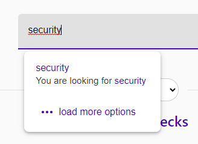
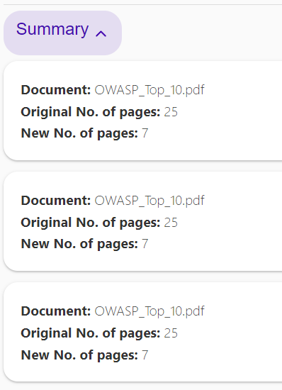

# PDF Shortener
Web app where you can shorten pages you don't need in your PDFs.

You can use the deployment [here](https://davidus27.github.io/pdf-shortener/).

## Table of contents
* [General info](#general-info)
* [Technologies](#technologies)
* [Usage](#usage)
* [Installation](#installation)


## Usage
The application is divided in 3 sections:
* **Introduction**: where you can upload your PDF and select the pages you want to shorten.
* **Checkout**: where you select filters by which you want to shorten the PDF.
* **Summary**: where you can see the final result and download the shortened PDF.

First you upload your PDF documents using dropzone or the upload button.


Then you select the pages you want to shorten. You can use either the keywords, the ranges or the selected three options:
- Based on highlighted text: the pages that contain highlighted text will be included in the shortened PDF.
- If the page contains images: only the pages that contain images will be included in the shortened PDF.
- If the page contains links: only the pages that contain links will be included in the shortened PDF.

You can also use multiple options and select the logical operator between them (AND or OR). 


You can add multiple keywords and if the page contains at least one of them, it will be included in the shortened PDF. 




You can either write the ranges in the text field or manually define them by using the selectors. On change the other one will be updated.


After finalizing the checkout, you will be redirected to the summary page where you can see the final result and download the shortened PDF. If it does not contain what you expected, you can go back and change the filters.

In case of defining filters that don't satisfy any pages of documents it will result in empty PDF.




## Installation
To run the application locally, you need to install the dependencies and run the application.
```
npm install
```

then run the application
```
npm run dev
```
to run the application in development mode or
```
npm run build
npm run start
```
to run the application in production mode.


## Code structure

### Components
The application is written in Svelte and the components are located in the [components/](./src/components/) folder. The [general](./src/components/general/) folder contains generic svelte components used on the page.

### Main logic
The main logic is located in the [core](./src/core/) folder. There are all functions needed to work with PDF documents.

We use [PDF.JS](https://www.npmjs.com/package/pdfjs-dist) library to load and parse PDF documents. To retrieve the text content, the highlight annotations and the links stored in the metadata.

After we calculate which pages are going to be included, we are going to remove the rest by using [pdf-lib](https://pdf-lib.js.org/) library.

### UI library
For the UI we use Svelte [Attractions](https://illright.github.io/attractions/) library. It includes all used components.

### Tests
For End-to-end testing of the application we use [Cypress](https://www.cypress.io/). All the necessary files are stored in the [cypress](./cypress/) folder.
```bash
npm run test # for unit tests
npm run test:cypress # for cypress tests
```
and also the option to start up the Cypress application and run the tests manually:
```bash
npm run test:gui
```

#### UML Diagram
The `core` library stored [here](./src/core/) is split into separate classes that are used to perform the operations on the PDF documents. The UML diagram of the library is shown below.

